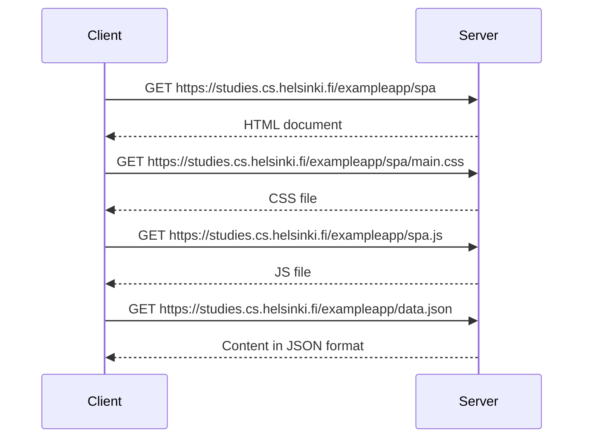

```mermaid
sequenceDiagram
    participant Alice as Client
    participant Bob as Server

    Alice->>Bob: GET https://studies.cs.helsinki.fi/exampleapp/spa
    Bob-->>Alice: HTML document
    Alice->>Bob: GET https://studies.cs.helsinki.fi/exampleapp/spa/main.css
    Bob-->>Alice: CSS file
    Alice->>Bob: GET https://studies.cs.helsinki.fi/exampleapp/spa.js
    Bob-->>Alice: JS file
    Alice->>Bob: GET https://studies.cs.helsinki.fi/exampleapp/data.json
    Bob-->>Alice: Content in JSON format
```